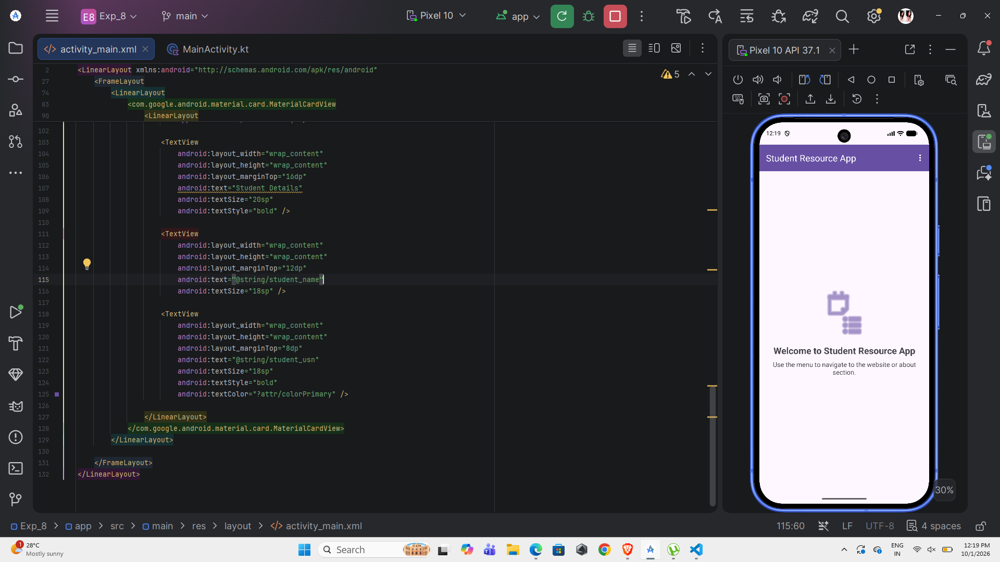
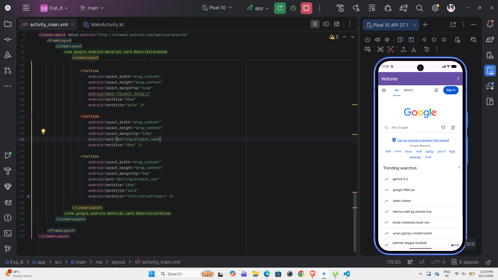
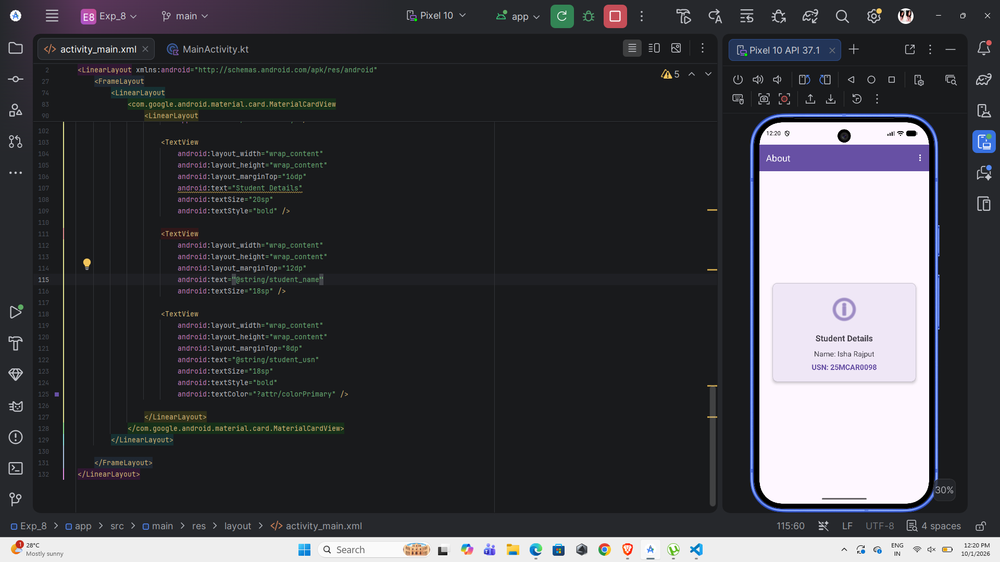

# Experiment 8: Implement Menus and WebView in an Android Application

## Aim
To develop an Android application demonstrating the implementation of Menus and a WebView component to load a webpage within the app.

## Objective
* To create an options menu for app navigation.
* To use a WebView to load a functional webpage inside the application without redirecting to an external browser.
* To manage the back navigation properly.

## Scenario
**Student Resource App:** An application with an Options Menu to navigate between three screens:
1. **Home:** Displays a welcome screen.
2. **Open Website:** Loads an external website using WebView inside the application.
3. **About:** Shows the student's name and USN.

## Technologies Used
| Technology     | Purpose                 |
| -------------- | ----------------------- |
| Android Studio | Development environment |
| Kotlin         | Programming language    |
| XML            | UI design               |
| Android SDK    | Android development     |
| Menu           | Application navigation  |
| WebView        | Displaying web content  |

## Concept / Theory

### Android Menus
Menus are a common user interface component in many types of applications. They provide a familiar interface for the user to access application functions and settings. An Options Menu or Toolbar menu is typically displayed in the AppBar (ActionBar) and is ideal for main navigation or actions.

### WebView
A `WebView` is an Android view that displays web pages. It is useful for displaying web content directly within an application, instead of opening a web browser. WebView can be configured to execute JavaScript and handle web navigation.

### Internet Permission
The application requires the `android.permission.INTERNET` permission in the `AndroidManifest.xml` file. This tells the Android system that the app is allowed to open network sockets, enabling the WebView to load pages from the internet.

## Application Features
* **AppBar Menu Navigation:** Three navigation options (Home, Open Website, About).
* **Integrated Web Browser:** A `WebView` configured to load a website seamlessly inside the app.
* **Custom Back Button Handling:** Navigates back in the WebView history if possible, otherwise navigates to the Home screen, and finally exits the app.
* **Student Details Screen:** Displays the student's Name and USN.

## Project Structure
```text
Experiment8/
├── app/
│   └── src/
│       └── main/
│           ├── java/
│           │   └── com.example.exp_8/
│           │       └── MainActivity.kt
│           ├── res/
│           │   ├── layout/
│           │   │   └── activity_main.xml
│           │   ├── menu/
│           │   │   └── main_menu.xml
│           │   └── values/
│           │       ├── strings.xml
│           │       ├── colors.xml
│           │       └── themes.xml
│           └── AndroidManifest.xml
├── README.md
├── build.gradle.kts
└── settings.gradle.kts
```

## Implementation

### 1. AndroidManifest.xml
Added the Internet permission:
```xml
<uses-permission android:name="android.permission.INTERNET" />
```

### 2. activity_main.xml
Created a layout with a `MaterialToolbar` and a `FrameLayout`. The `FrameLayout` contains three view groups: one for Home, one for WebView, and one for About.
```xml
<com.google.android.material.appbar.MaterialToolbar
    android:id="@+id/toolbar"
    android:layout_width="match_parent"
    android:layout_height="?attr/actionBarSize" />
```

### 3. main_menu.xml
Defined the options menu:
```xml
<menu>
    <item android:id="@+id/action_home" android:title="@string/menu_home" />
    <item android:id="@+id/action_website" android:title="@string/menu_website" />
    <item android:id="@+id/action_about" android:title="@string/menu_about" />
</menu>
```

### 4. MainActivity.kt
Configured the toolbar as the ActionBar, handled menu selections, and configured the WebView:
```kotlin
override fun onCreateOptionsMenu(menu: Menu?): Boolean {
    menuInflater.inflate(R.menu.main_menu, menu)
    return true
}

private fun setupWebView() {
    webView.settings.javaScriptEnabled = true
    webView.webViewClient = WebViewClient() 
    webView.loadUrl("https://www.google.com")
}
```

## Test Cases

| Test Case | Description        | Expected Result                |
| --------- | ------------------ | ------------------------------ |
| TC01      | Application Launch | Home screen opens successfully |
| TC02      | WebView            | Website loads inside the app   |
| TC03      | Student Details    | Name and USN are displayed     |

### Test Case 1 – Application Launch
**Expected Result:** Application launches successfully. The home screen and the menu are visible.


### Test Case 2 – WebView
**Expected Result:** Selecting "Open Website" loads the webpage successfully inside the Android application using WebView.


## Output Screenshots


## Result
The experiment successfully implemented Android Menus and a WebView component in a single Android application. Menu selections navigated smoothly between the Home screen, the embedded WebView, and the About screen containing the student details.